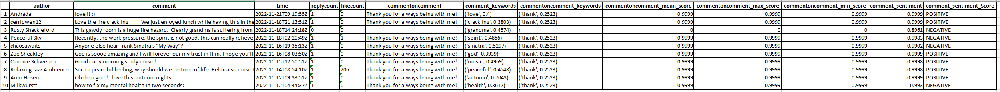

# Youtube Comments Extractor
Colab Version Link : https://colab.research.google.com/drive/1FOiNauPRL3V0GCe0CBI8fG3-KHeBZhXR?usp=sharing

## Purpose
To crawl and get the sentiments of the comments and comments on comment on multiple Youtube videos.
  

## Requirements
- To store the file into S3, S3 buckets and credential need to be configured
- To store the file into cwd, users shall have privilege to wrtie the file.
- Install dependency (Requirement.txt)
- Users need to create API key for Google API client:
  - https://support.google.com/googleapi/answer/6158862?hl=en

## Data to be collected
This will collect Youtube comments along with the followings:
   - date of comments published
   - Username of the comment
   - comments on comments
   - Number of comments on comment
   - number of "likes" that comment gets
   - Extracted keyword from comment
   - Extracted keyword from comment on comment
   - Sentiment and sentiment scores of comment
   - Sentiment and sentiment scores of comment on comment

## How to use it:
1. Please configure the config_example py.
2. Change the file name from config_example.py to config.py 
3. Run the main.py